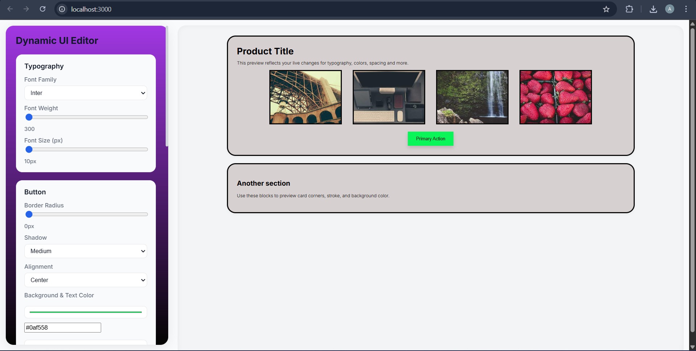
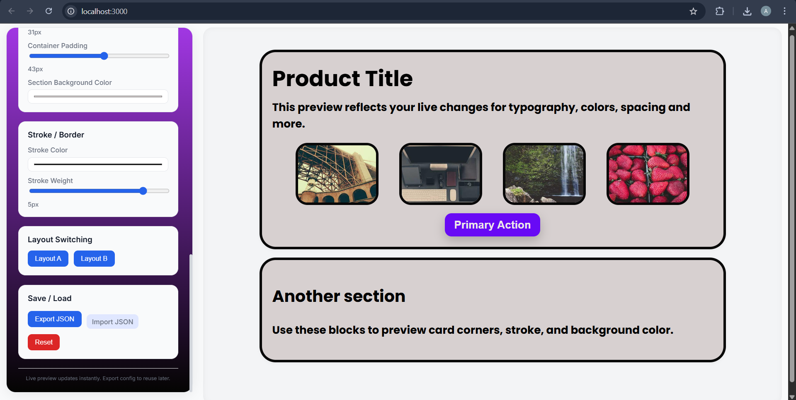
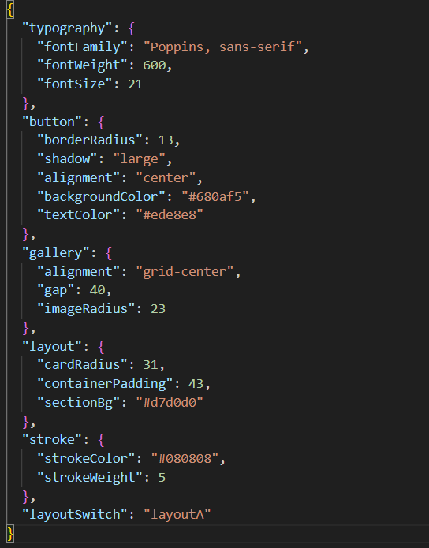

# Dynamic UI Editor

A React app that provides a dynamic editor for customizing UI components (typography, buttons, galleries, layout, stroke/border) and a live preview. Includes layout switching and JSON export/import.

## Features
- Typography: font family, weight, size.
- Button: border radius, shadow, alignment, background and text color.
- Galleries: alignment variants, spacing, image border radius.
- General layout: card radius, container padding, section background color.
- Stroke/border: stroke color and weight.
- Layout switching: Layout A and Layout B.
- Live preview updates instantly.
- Export configuration as JSON and import JSON to load a configuration.
- Persists configuration to `localStorage`.

# Screenshots

## Sample 1
- 
## Sample 2
- 
## Exported JSON
- 

## Run locally
1. `npm install`
2. `npm start`

Open http://localhost:3000